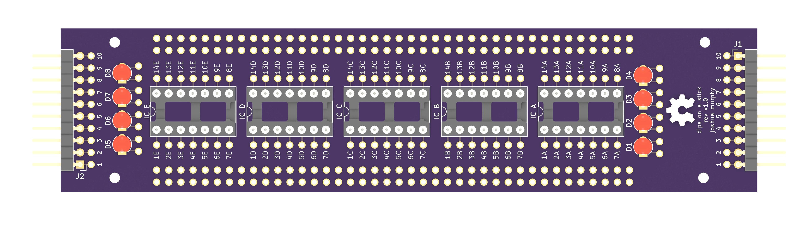

# dips on a stick

Custom-made protoboard PCB for building digital logic circuits out of TTL chips. A stick contains room for five DIP-14 sockets with breakout pins for each socket pin, 160 prototyping holes along its sides, space for 8 LEDs, 8 resistors, and 10 input/output pins on each side of the stick for combining modules to create more complex digital logic circuits. Sticks can be connected end to end or with ribbon cables. M2 mounting holes are provided for mounting. 
